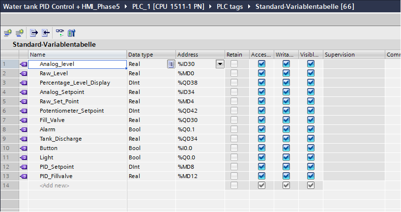
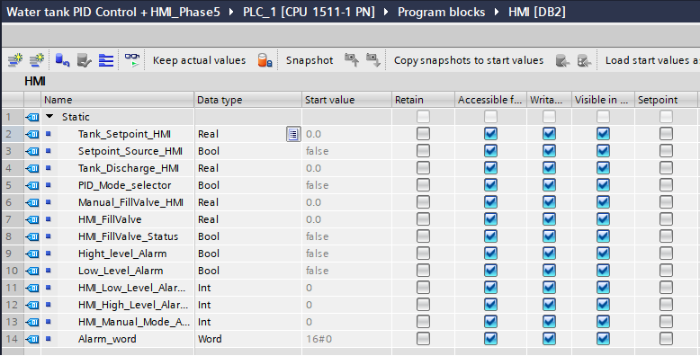

<div align="center">

# 🚀 PLC Tank Level PID Control System with WinCC HMI

### Industrial Process Automation using Siemens TIA Portal, WinCC Comfort & Factory I/O


---

*A complete industrial automation project demonstrating PLC programming, PID control, Human-Machine Interface (HMI) development, alarm management, and Factory I/O process simulation.*

</div>

---

## 📚 Table of Contents

- [📖 Project Overview](#-project-overview)
- [🎯 Project Objectives](#-project-objectives)
- [🛠 Software Used](#-software-used)
- [⚙ Technologies Demonstrated](#-technologies-demonstrated)
- [🏭 System Architecture](#-system-architecture)
- [📂 Repository Structure](#-repository-structure)
- [🚀 Development Journey](#-development-journey)
  - [Phase 1 – PLC-HMI Communication](#-phase-1--plc-hmi-communication)
  - [Phase 2 – Plant Overview Screen](#-phase-2--plant-overview-screen)
  - [Phase 3 – Tank Detail Screen](#-phase-3--tank-detail-screen)
  - [Phase 4 – Alarm Management](#-phase-4--alarm-management)
  - [Phase 5 – Alarm Viewer](#-phase-5--alarm-viewer)
  - [Phase 6 – Final System Demonstration](#-phase-6--final-system-demonstration)
- [🔧 Technical Documentation](#-technical-documentation)
- [👨‍💻 Author](#-author)

## 🌟 Highlights

- ✅ Siemens S7 PLC Programming
- ✅ PID_Compact Process Control
- ✅ WinCC Comfort HMI Development
- ✅ Factory I/O Process Simulation
- ✅ Analog Signal Scaling
- ✅ Auto / Manual Process Control
- ✅ Multi-Screen HMI Navigation
- ✅ Alarm Management & Acknowledgement
- ✅ Industrial Documentation


## 📸 Project Preview

<p align="center">


</p>


> **This repository documents the complete development of an industrial water tank level control system, from basic PLC-HMI communication to a fully integrated PID-controlled process with operator interface, alarm management, and Factory I/O simulation.**


A complete industrial process automation project developed using **Siemens TIA Portal**, **WinCC Comfort**, **PLCSIM**, and **Factory I/O**. This project demonstrates the implementation of a PID-controlled water tank system with a professional Human-Machine Interface (HMI), manual and automatic operating modes, alarm management, and real-time process visualization.

---

# 📖 Project Overview

This project simulates an industrial water tank level control process commonly found in water treatment plants, chemical industries, food processing facilities, and other process automation applications.

The system uses a Siemens PLC to monitor and control the tank level through a PID controller while allowing operators to interact with the process using a WinCC HMI. Throughout the project, the HMI was gradually developed from a simple communication test into a complete operator interface featuring multiple screens, process visualization, alarm management, and manual process control.

The repository documents the complete development journey, allowing readers to understand not only the final result but also the engineering decisions made during each stage of implementation.

---

# 🎯 Project Objectives

- Establish reliable PLC ↔ HMI communication.
- Design a professional operator interface using WinCC Comfort.
- Implement PID-based automatic tank level control.
- Allow operators to switch between automatic and manual operation.
- Support both potentiometer and HMI setpoint control.
- Visualize the complete process in real time.
- Implement alarm monitoring and alarm acknowledgement.
- Demonstrate a realistic industrial automation workflow using Factory I/O.

---

# 🛠 Software Used

- Siemens TIA Portal V17
- WinCC Comfort
- Siemens PLCSIM
- Factory I/O

---

# ⚙️ Technologies Demonstrated

- PLC Programming (Ladder Logic)
- PID_Compact Controller
- Analog Scaling
- Process Automation
- Human-Machine Interface (HMI)
- WinCC Runtime
- Factory I/O Integration
- Alarm Management
- Auto / Manual Control
- Process Visualization
- Industrial Documentation

---

# 🏭 System Architecture

```text
                 Factory I/O
                      │
                      ▼
             Siemens S7 PLC
                      │
        ┌─────────────┴─────────────┐
        │                           │
   PID Controller             Alarm Logic
        │                           │
        └─────────────┬─────────────┘
                      │
                 WinCC HMI
                      │
      ┌───────────────┼────────────────┐
      │               │                │
  Overview      Tank Detail      Alarm Viewer
```

---

# 📂 Repository Structure

```text
plc-tank-level-pid-hmi-system/
│
├── README.md
├── LICENSE
│
├── Documentation/
│   ├── global_db_hmi_tags.png
│   └── plc_tags.png
│
├── Phase 1 - PLC-HMI Communication/
├── Phase 2 - Plant Overview Screen/
├── Phase 3 - Tank Detail Screen/
├── Phase 4 - Alarm Management/
├── Phase 5 - Alarm Viewer/
└── Phase 6 - Final System Demonstration/
```

---

# 🚀 Development Journey

Rather than building the entire HMI in a single step, the project was developed progressively in six phases. Each phase introduced new functionality while preserving and improving the work completed in previous stages.

This development approach closely resembles how industrial automation projects evolve during real engineering implementation.

---

# 📁 Phase 1 – PLC-HMI Communication

## Objective

Establish reliable communication between the Siemens PLC and the WinCC HMI.

During this phase, the HMI was connected to the PLC, communication was verified, and basic interaction between the operator interface and PLC program was successfully established.

### Features Implemented

- PLC ↔ HMI communication
- HMI button control
- Status indication
- Runtime verification

### Screenshots

#### PLC-HMI Connection


#### Runtime (OFF)


#### Runtime (ON)


#### PLC Program


---

# 📁 Phase 2 – Plant Overview Screen

## Objective

Develop a real-time overview screen allowing operators to monitor the complete process from a single interface.

This phase transformed the HMI from a communication test into an operator monitoring screen capable of displaying process information in real time.

### Features Implemented

- Live tank level display
- Live setpoint display
- Fill valve status
- PID mode indication
- Factory I/O integration
- Process monitoring

### Screenshots

#### Plant Overview


#### Live Process Monitoring


#### Tank Level & Setpoint


#### Valve Status & PID Mode


### Demonstration

🎥 Video:


---

# 📁 Phase 3 – Tank Detail Screen

## Objective

Develop a dedicated operator control screen that provides complete interaction with the PID-controlled tank level process.

Unlike the Plant Overview screen, which focuses on process monitoring, the Tank Detail screen enables operators to directly control the process by adjusting setpoints, switching between automatic and manual operating modes, and manually operating the fill valve when required.

This phase introduced the core operational features commonly found in industrial process HMIs.

### Features Implemented

- HMI and Potentiometer setpoint source selection
- Live setpoint modification through HMI
- PID Auto / Manual mode selection
- Manual fill valve control
- Dynamic enabling and disabling of controls
- Live Factory I/O process visualization
- Tank level monitoring
- PLC selection logic using Ladder Logic

---

## Screenshots

### Tank Detail Screen


---

### Setpoint Source Selection


---

### HMI Setpoint Control


---

### Potentiometer Setpoint Control


---

### PID Automatic Mode


---

### PID Manual Mode


---

### Manual Fill Valve Control


---

### Disabled Controls Based on Operating Mode


---

### PLC Selection Logic


---

### Factory I/O and HMI Runtime


---

### Demonstration

🎥 Video:


---

### Alarm Indicator (Active)


---

### High Level Alarm


---

### Low Level Alarm


---

### Manual Mode Alarm


---

### Navigation — Overview to Tank Detail


---

### Navigation — Tank Detail to Overview


---

### PLC Alarm Logic


---

### Demonstration

🎥 Video:


---

# 📁 Phase 5 – Alarm Viewer

## Objective

Create a centralized alarm monitoring interface that allows operators to view, acknowledge, and monitor active process alarms in real time.

This phase completes the HMI by introducing alarm visualization similar to those used in industrial process control systems.

### Features Implemented

- Alarm Viewer
- Active alarm display
- Alarm acknowledgement
- Alarm history
- Alarm navigation
- Multiple alarm monitoring

---

## Screenshots

### Alarm Viewer


---

### High Level Alarm View


---

### Low Level Alarm View


---

### Manual Mode Alarm View


---

### Alarm History


---

### Navigation


---

### Demonstration

🎥 Video:


---

# 📁 Phase 6 – Final System Demonstration

## Objective

Demonstrate the complete industrial automation system operating as an integrated process from Factory I/O simulation through PLC control and WinCC HMI supervision.

This final demonstration showcases every feature developed throughout the project, including process monitoring, PID control, operator interaction, alarm management, and HMI navigation.

### Final Demonstration

🎥 Video:


---

# ✅ Project Summary

By the completion of this project, the following industrial automation concepts have been successfully implemented and demonstrated:

- PLC Programming using Ladder Logic
- PID_Compact Process Control
- Analog Scaling
- Process Visualization
- Factory I/O Integration
- WinCC Comfort HMI Development
- Multi-Screen HMI Navigation
- Auto / Manual Process Operation
- HMI Setpoint Control
- Potentiometer Setpoint Selection
- Manual Valve Control
- Alarm Management
- Alarm Viewer
- Industrial Documentation

---

# 🔧 Technical Documentation

This section provides a detailed overview of the control strategy, PLC program organization, HMI architecture, PID implementation, alarm handling, and system workflow used throughout the project.

The objective was not only to build a working automation system but also to organize the project using practices commonly found in industrial automation projects.

---

# 📌 Control Philosophy

The control philosophy of this project was designed around a simple industrial process:

- Monitor the tank level continuously.
- Maintain the desired level using PID control.
- Allow operators to modify the setpoint.
- Support both automatic and manual operation.
- Provide process visualization through an HMI.
- Notify operators whenever abnormal conditions occur.

Instead of implementing every feature directly inside the PID controller, the PLC program separates the process into independent functional sections.

This modular approach improves readability, troubleshooting, and future scalability.

---

# 🧠 PLC Program Structure

The PLC program is divided into logical sections responsible for different parts of the control system.

## Main Program (OB1)

Responsible for:

- Overall process execution
- Manual/Automatic operating logic
- Setpoint source selection
- Alarm generation
- HMI communication
- Valve selection logic

---

## Cyclic Interrupt (OB30)

Responsible for executing the PID controller at a fixed interval.

Functions performed:

- PID execution
- Process variable calculation
- Output generation
- Stable control loop timing

Using a cyclic interrupt ensures that the PID controller executes at a constant rate independent of the OB1 scan time.

---

# 📊 PID Control Strategy

The project uses the Siemens **PID_Compact** Technology Object.

## Process Variable (PV)

Current Tank Level (%)

---

## Setpoint (SP)

Selectable from two different sources:

- Factory I/O Potentiometer
- WinCC HMI

The operator can switch between these sources at runtime without modifying the PLC program.

---

## Controller Output

The PID controller calculates the required Fill Valve opening to maintain the desired tank level.

The calculated output is automatically transferred to the process whenever Automatic Mode is enabled.

---

# 🔄 Auto / Manual Operating Philosophy

A common requirement in industrial automation is allowing operators to temporarily override automatic control.

This project implements two operating modes.

## Automatic Mode

The PID controller has complete control over the Fill Valve.

Operator responsibilities:

- Adjust the desired setpoint.
- Monitor the process.

The controller automatically regulates the tank level.

---

## Manual Mode

Automatic PID control is disabled.

The operator directly controls the Fill Valve using the HMI.

This operating mode is useful during:

- System testing
- Commissioning
- Maintenance
- Troubleshooting

The implementation uses selector logic to ensure that only one control source can command the Fill Valve at any given time.

---

# 🎛 Setpoint Selection Strategy

Two independent setpoint sources are available.

## Potentiometer

Allows physical adjustment of the tank level from Factory I/O.

---

## HMI

Allows the operator to enter the desired tank level directly through the WinCC interface.

Only one source is active at a time.

The inactive input is automatically disabled on the HMI to provide clear operator feedback and prevent unintended interaction.

---

# 🚨 Alarm Management

The project includes a basic alarm management system for monitoring abnormal process conditions.

Implemented alarms include:

- High Tank Level Alarm
- Low Tank Level Alarm
- PID Manual Mode Notification

Alarm conditions are generated inside the PLC before being transferred to the HMI.

The HMI provides:

- Active alarm indication
- Alarm Viewer
- Alarm acknowledgement
- Alarm navigation

This implementation follows the same workflow commonly used in industrial operator stations.

---

# 🖥 HMI Screen Overview

The HMI consists of three operator screens.

## 1. Plant Overview

Primary monitoring screen.

Displays:

- Tank level
- Setpoint
- Valve status
- PID operating mode
- Alarm indication

---

## 2. Tank Detail

Primary operator control screen.

Provides:

- Setpoint source selection
- Manual fill valve operation
- PID Auto / Manual selection
- Live tank level visualization

---

## 3. Alarm Viewer

Dedicated alarm monitoring screen.

Displays:

- Active alarms
- Alarm acknowledgement
- Alarm information
- Navigation between HMI screens

---

# 🗂 PLC Tag List

The complete PLC tag list used throughout the project is available below.



---

# 🗂 Global DB HMI Tags

The HMI communicates with the PLC through a dedicated Global Data Block.

The complete Global DB tag list is provided below.



---

# 🔄 Overall System Workflow

The following sequence summarizes the complete operation of the automation system.

```text
Factory I/O Sensors
          │
          ▼
      Siemens PLC
          │
          ▼
Analog Scaling
          │
          ▼
 PID Controller
          │
          ▼
Auto / Manual Selection
          │
          ▼
 Fill Valve Control
          │
          ▼
 Factory I/O Tank
          │
          ▼
 Alarm Monitoring
          │
          ▼
 WinCC HMI
```

---

# 📚 Skills Demonstrated

This project demonstrates practical experience with:

- Siemens TIA Portal
- Ladder Logic Programming
- WinCC Comfort HMI
- Factory I/O Integration
- PID_Compact Technology Object
- Analog Process Control
- HMI Design
- Alarm Management
- Process Visualization
- PLC-HMI Communication
- Industrial Documentation

---

# 🎓 Learning Outcomes

Through this project, the following concepts were successfully implemented and understood:

- Real-time PLC and HMI communication
- Analog signal scaling
- PID tuning and process stabilization
- Human-Machine Interface development
- Operator-oriented interface design
- Auto / Manual control philosophy
- Alarm generation and acknowledgement
- Multi-screen HMI navigation
- Industrial project documentation

---

# 🚀 Future Improvements

Potential future enhancements include:

- Historical trend graphs
- Alarm archiving
- User authentication
- Data logging
- Recipe management
- Process reports
- Remote SCADA connectivity
- OPC UA communication
- Multi-tank process expansion

---

# 👨‍💻 Author

**Fuad Faisal**

Bachelor of Engineering – Mechatronics Engineering

Focused on Industrial Automation, PLC Programming, Process Control, and Industrial Control Systems.

GitHub:
https://github.com/fuadfaisalp-bit

LinkedIn:
www.linkedin.com/in/-fuadfaisal-

---

# 📄 License

This project is released under the MIT License.

Feel free to use this repository for educational and learning purposes while providing appropriate attribution.
